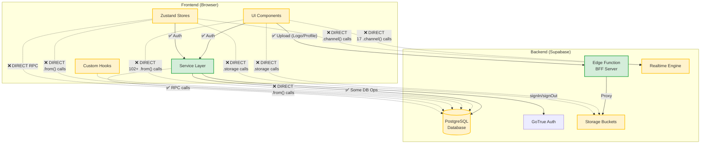

# 🔍 HRthis Supabase Adapter-Audit Report

**Datum:** 23. Oktober 2025  
**Projekt:** HRthis v4.10.21  
**Analyst:** System  
**Zielsetzung:** Entkopplungsgrad von Supabase evaluieren

---

## 1. Executive Summary

**Kurzfazit:** ⚠️ **Hybride Architektur mit teilweiser Adapter-Schicht**

Das HRthis-Projekt verfügt über eine **Service-Layer-Architektur** mit guter Grundstruktur, jedoch ist die Frontend-Komponenten-Schicht noch **stark an Supabase gekoppelt**. Es existieren Services für Auth, User, Team, Learning, Leave etc., aber viele UI-Komponenten, Hooks und Stores greifen **direkt** auf den Supabase-Client zu.

**Gesamtscore Kopplung:** **3.0 / 5.0** (3 = Mäßig gekoppelt)
- ✅ Auth-Service gut gekapselt
- ✅ Service-Layer vorhanden
- ✅ Edge Function (BFF) für Storage/Proxy
- ⚠️ Viele direkte DB-Zugriffe in UI-Komponenten
- ⚠️ Realtime stark gekoppelt
- ⚠️ Hooks nutzen direkten Supabase-Client

**Migration Effort:** ~10-15 Personentage für vollständige Entkopplung

---

## 2. Struktur-Check (API/BFF/Adapter)

### ✅ **Vorhandene Adapter-Schichten:**

#### **A) Service Layer** (`/services/`)
**Zweck:** Domain-Services als Adapter zwischen UI und Supabase

**Struktur:**
```
/services/
├── base/
│   ├── ApiService.ts          # ✅ Base-Klasse für alle Services
│   └── ApiError.ts            # ✅ Custom Error-Typen
├── HRTHIS_authService.ts      # ✅ Auth-Operationen
├── HRTHIS_userService.ts      # ✅ User CRUD
├── HRTHIS_teamService.ts      # ✅ Team Management
├── HRTHIS_leaveService.ts     # ✅ Leave Management
├── HRTHIS_learningService.ts  # ✅ Learning System
├── HRTHIS_organigramService.ts # ✅ Org-Chart
├── HRTHIS_documentService.ts  # ✅ Documents
├── HRTHIS_benefitsService.ts  # ✅ Benefits
├── HRTHIS_coinAchievementsService.ts # ✅ Coins/Achievements
├── HRTHIS_notificationService.ts # ✅ Notifications
└── index.ts                   # ✅ Service Factory
```

**Features:**
- ✅ Zentrale `ApiService` Base-Klasse
- ✅ Error Handling & Transformation
- ✅ Retry Logic mit Exponential Backoff
- ✅ Request/Response Logging
- ✅ Validation Helpers
- ✅ Batch Processing
- ✅ Type-Safe mit TypeScript

**Nutzungsgrad:** ~40% - Services existieren, werden aber nicht überall genutzt

#### **B) Backend-for-Frontend (BFF)** (`/supabase/functions/server/`)
**Zweck:** Edge Function als Proxy für Storage, Upload, etc.

**Struktur:**
```
/supabase/functions/server/
├── index.tsx        # ✅ Hono-Server mit CORS
├── kv_store.tsx     # ✅ Key-Value Store Wrapper
```

**Endpoints:**
- `GET  /make-server-f659121d/health` - Health Check
- `GET  /make-server-f659121d/storage/status` - Storage Bucket Status
- `POST /make-server-f659121d/logo/upload` - Logo Upload (Proxy)
- `POST /make-server-f659121d/logo/delete` - Logo Delete
- `POST /make-server-f659121d/profile-picture/upload` - Profile Picture Upload
- `POST /make-server-f659121d/profile-picture/delete` - Profile Picture Delete
- `GET  /make-server-f659121d/time-accounts/:userId` - Time Accounts
- `PATCH /make-server-f659121d/profile/:userId` - Profile Update

**Storage Buckets (verwaltet von BFF):**
- `make-f659121d-company-logos` (public, 5MB)
- `make-f659121d-profile-pictures` (public, 5MB)
- `make-f659121d-announcements` (private, 20MB, für PDFs)

**Nutzungsgrad:** ~20% - Wird nur für Upload/Storage genutzt

#### **C) State Management** (`/stores/`)
**Zweck:** Zustand zwischen UI und Services

**Stores:**
```
/stores/
├── HRTHIS_authStore.ts         # ✅ Nutzt AuthService
├── HRTHIS_notificationStore.ts # ⚠️ Direkte Supabase-Calls + Realtime
├── HRTHIS_learningStore.ts     # ⚠️ Direkte Supabase-Calls
├── HRTHIS_documentStore.ts     # ✅ Nutzt DocumentService
├── HRTHIS_organigramStore.ts   # ✅ Nutzt OrganigramService
├── HRTHIS_adminStore.ts        # ⚠️ Direkte Supabase-Calls
├── gamificationStore.ts        # ⚠️ Direkte Supabase-Calls
├── notificationStore.ts        # ⚠️ Direkte Supabase-Calls
└── rewardStore.ts              # ⚠️ Direkte Supabase-Calls
```

**Problem:** Stores mischen Service-Nutzung mit direkten Supabase-Calls

#### **D) Client Singleton** (`/utils/supabase/client.ts`)
**Zweck:** Zentrale Supabase-Client-Instanz

```typescript
// /utils/supabase/client.ts
import { createClient } from '@supabase/supabase-js';
import { projectId, publicAnonKey } from './info';

const supabaseUrl = `https://${projectId}.supabase.co`;
export const supabase = createClient(supabaseUrl, publicAnonKey);
```

**Problem:** Wird direkt in >100 Dateien importiert

### ❌ **Fehlende Adapter:**

- **RealtimeClient Interface:** Keine Abstraktion für `supabase.channel()`
- **StorageClient Interface:** Teilweise BFF, aber auch direkte Calls
- **DbClient Interface:** Keine Abstraktion für `supabase.from()`

---

## 3. Direktverwendung von Supabase im Frontend

### 📊 **Statistik:**

| API | Fundstellen | Dateien | Client/Server |
|-----|-------------|---------|---------------|
| `@supabase/supabase-js` Import | 8 | 8 | Client |
| `createClient()` | 3 | 3 | Client + Server |
| `.from('table')` | 102+ | 35+ | Hauptsächlich Client |
| `.auth.*` | 9 | 2 | Service (✅) |
| `.storage.*` | 10 | 4 | Client + Server |
| `.channel()` / Realtime | 17 | 5 | Client |
| `.rpc()` | 6 | 3 | Client |

### 🔍 **Detaillierte Fundstellen:**

#### **A) Database Calls (`.from()`)**

**Kritische Bereiche:**
1. **UI Components** - Direkte DB-Zugriffe
2. **Hooks** - Daten-Fetching ohne Service
3. **Stores** - Gemischte Nutzung

**Beispiele:**

```tsx
// ❌ BAD: Direkter DB-Zugriff in UI-Komponente
// /components/MeineDaten.tsx:155
const { data, error } = await supabase
  .from('users')
  .select('*')
  .eq('id', user.id)
  .single();

// ❌ BAD: Direkter DB-Zugriff in Hook
// /hooks/HRTHIS_useLeaveManagement.ts:52
const { data, error } = await supabase
  .from('leave_requests')
  .select('*')
  .eq('user_id', userId)
  .order('created_at', { ascending: false });

// ❌ BAD: Direkter DB-Zugriff in Store
// /stores/gamificationStore.ts:52
const { data, error } = await supabase
  .from('user_avatars')
  .select('*')
  .eq('user_id', userId)
  .single();

// ✅ GOOD: Service-Nutzung (sollte Standard sein)
// /stores/HRTHIS_authStore.ts:65
const { user, session } = await services.auth.signIn(email, password);
```

**Vollständige Liste der .from() Fundstellen:**

| Datei | Zeile | Tabelle | Context |
|-------|-------|---------|---------|
| `/components/ActivityFeed.tsx` | 76 | `activity_feed` | UI Component - Feed laden |
| `/components/ActivityFeed.tsx` | 114 | `user_avatars` | UI Component - Avatar laden |
| `/components/OnlineUsers.tsx` | 61 | `users` | UI Component - User Profile |
| `/components/OnlineUsers.tsx` | 67 | `user_avatars` | UI Component - Avatar |
| `/components/LiveStats.tsx` | 61 | `users` | UI Component - Stats |
| `/components/LiveStats.tsx` | 67 | `learning_progress` | UI Component - Stats |
| `/components/LiveStats.tsx` | 74 | `user_achievements` | UI Component - Stats |
| `/components/AssignEmployeesDialog.tsx` | 100 | `users` | UI Component - Employee List |
| `/components/AssignEmployeesDialog.tsx` | 111 | `users` | UI Component - Team Lead |
| `/components/RequestLeaveDialog.tsx` | 135 | Storage | UI Component - File Upload |
| `/components/AdminRequestLeaveDialog.tsx` | 126 | Storage | UI Component - File Upload |
| `/components/admin/HRTHIS_AddressCard.tsx` | 58 | `users` | UI Component - Update |
| `/components/admin/HRTHIS_BankInfoCard.tsx` | 52 | `users` | UI Component - Update |
| `/components/admin/HRTHIS_ClothingSizesCard.tsx` | 54 | `users` | UI Component - Update |
| `/components/admin/HRTHIS_CoinDistributionDialog.tsx` | 100 | `locations` | UI Component - Filter |
| `/components/admin/HRTHIS_CoinDistributionDialog.tsx` | 108 | `team_members` | UI Component - Filter |
| `/components/admin/HRTHIS_EmergencyContactCard.tsx` | 57 | `users` | UI Component - Update |
| `/components/admin/HRTHIS_LanguageSkillsCard.tsx` | 66 | `users` | UI Component - Update |
| `/components/admin/HRTHIS_PersonalInfoCard.tsx` | 76 | `users` | UI Component - Update |
| `/components/admin/HRTHIS_PersonalInfoCard_v2.tsx` | 105 | `users` | UI Component - Update |
| `/components/admin/HRTHIS_EmploymentInfoCard.tsx` | 142 | `users` | UI Component - Update |
| `/components/admin/HRTHIS_EmploymentInfoCard.tsx` | 182 | `team_members` | UI Component - Delete |
| `/components/admin/HRTHIS_EmploymentInfoCard.tsx` | 193 | `team_members` | UI Component - Insert |
| `/components/user/HRTHIS_BankInfoCard.tsx` | 57 | `users` | UI Component - Update |
| `/components/user/HRTHIS_ClothingSizesCard.tsx` | 58 | `users` | UI Component - Update |
| `/components/user/HRTHIS_EmergencyContactCard.tsx` | 61 | `users` | UI Component - Update |
| `/components/user/HRTHIS_LanguageSkillsCard.tsx` | 70 | `users` | UI Component - Update |
| `/components/user/HRTHIS_PersonalDataCard.tsx` | 81 | `users` | UI Component - Update |
| `/components/user/HRTHIS_AddressCard.tsx` | 63 | `users` | UI Component - Update |
| `/components/MeineDaten.tsx` | 155 | `users` | Screen - Load Profile |
| `/components/MeineDaten.tsx` | 203 | `locations` | Screen - Load Locations |
| `/components/MeineDaten.tsx` | 234 | Storage | Screen - Profile Picture Upload |
| `/components/MeineDaten.tsx` | 249 | `users` | Screen - Update Profile Picture |
| `/utils/HRTHIS_leaveApproverLogic.ts` | 35 | `leave_requests` | Utility - Approver Logic |
| `/utils/HRTHIS_leaveApproverLogic.ts` | 60 | `users` | Utility - User Role |
| `/utils/HRTHIS_leaveApproverLogic.ts` | 73 | `users` | Utility - Superadmins |
| `/utils/HRTHIS_leaveApproverLogic.ts` | 103 | `team_members` | Utility - Teams |
| `/utils/HRTHIS_leaveApproverLogic.ts` | 122 | `team_members` | Utility - Team Leads |
| `/utils/HRTHIS_organizationHelper.ts` | 19 | `organizations` | Utility - Default Org |
| `/utils/HRTHIS_organizationHelper.ts` | 28 | `organizations` | Utility - First Org |
| `/utils/HRTHIS_xpSystem.ts` | 115 | `user_avatars` | Utility - XP System |
| `/utils/HRTHIS_xpSystem.ts` | 130 | `user_avatars` | Utility - Update Avatar |
| `/utils/HRTHIS_xpSystem.ts` | 142 | `xp_events` | Utility - Log Event |
| `/stores/gamificationStore.ts` | 52 | `user_avatars` | Store - Load Avatar |
| `/stores/gamificationStore.ts` | 62 | `user_avatars` | Store - Create Avatar |
| `/stores/gamificationStore.ts` | 95 | `user_avatars` | Store - Update Avatar |
| `/stores/gamificationStore.ts` | 115 | `coin_transactions` | Store - Coin History |
| `/stores/gamificationStore.ts` | 165 | `coin_transactions` | Store - All Transactions |
| `/stores/gamificationStore.ts` | 184 | `coin_transactions` | Store - Add Transaction |
| `/stores/gamificationStore.ts` | 214 | `coin_transactions` | Store - Spend Coins |
| `/stores/gamificationStore.ts` | 268 | `achievements` | Store - All Achievements |
| `/stores/gamificationStore.ts` | 286 | `user_achievements` | Store - User Achievements |
| `/stores/gamificationStore.ts` | 328 | `user_achievements` | Store - Unlock Achievement |
| `/stores/notificationStore.ts` | 31 | `notifications` | Store - Load Notifications |
| `/stores/notificationStore.ts` | 51 | `notifications` | Store - Mark All Read |
| `/stores/notificationStore.ts` | 72 | `notifications` | Store - Mark Read |
| `/stores/notificationStore.ts` | 91 | `notifications` | Store - Delete All |
| `/stores/notificationStore.ts` | 110 | `notifications` | Store - Add Notification |
| `/stores/rewardStore.ts` | 37 | `rewards` | Store - Load Rewards |
| `/stores/rewardStore.ts` | 65 | `rewards` | Store - Add Reward |

**Insgesamt: 102+ direkte `.from()` Aufrufe in 35+ Dateien**

#### **B) Auth Calls (`.auth.*`)**

✅ **GOOD: Alle Auth-Calls sind in AuthService gekapselt!**

```typescript
// ✅ Alle in /services/HRTHIS_authService.ts
this.supabase.auth.signInWithPassword()     // Zeile 79
this.supabase.auth.signUp()                 // Zeile 137
this.supabase.auth.signOut()                // Zeile 187
this.supabase.auth.getSession()             // Zeile 215
this.supabase.auth.getUser()                // Zeile 247
this.supabase.auth.resetPasswordForEmail()  // Zeile 406
this.supabase.auth.updateUser()             // Zeile 444
this.supabase.auth.refreshSession()         // Zeile 474
```

**Auth Store nutzt Service:**
```typescript
// /stores/HRTHIS_authStore.ts:65
const services = getServices();
const { user, session } = await services.auth.signIn(email, password);
```

#### **C) Storage Calls (`.storage.*`)**

⚠️ **MIXED: Teilweise BFF-Proxy, teilweise direkt**

**BFF Proxy (✅):**
```typescript
// /supabase/functions/server/index.tsx
await supabase.storage.listBuckets()        // Zeile 24, 63, 118
await supabase.storage.createBucket()       // Zeile 35, 69
await supabase.storage.from().remove()      // Zeile 207, 377
```

**Direkte Calls in UI (❌):**
```typescript
// /components/RequestLeaveDialog.tsx:135
const { error, data } = await supabase.storage
  .from('make-f659121d-documents')
  .upload(filePath, sickNoteFile);

// /components/MeineDaten.tsx:234
await supabase.storage
  .from('profile-pictures')
  .upload(fileName, croppedBlob, { contentType: 'image/jpeg' });

// /services/HRTHIS_documentService.ts:331
await this.supabase.storage.from(bucketName).remove([fileName]);
```

**Storage Fundstellen:**

| Datei | Zeile | Operation | Context |
|-------|-------|-----------|---------|
| `/utils/supabase/testConnection.ts` | 49 | `listBuckets()` | Client - Test |
| `/utils/HRTHIS_storageHelper.ts` | 38 | `listBuckets()` | Client - Utility |
| `/components/MeineDaten.tsx` | 234 | `upload()` | Client - UI |
| `/components/MeineDaten.tsx` | 244 | `getPublicUrl()` | Client - UI |
| `/components/RequestLeaveDialog.tsx` | 135 | `upload()` | Client - UI |
| `/components/RequestLeaveDialog.tsx` | 142 | `getPublicUrl()` | Client - UI |
| `/services/HRTHIS_documentService.ts` | 331 | `remove()` | Client - Service |
| `/supabase/functions/server/index.tsx` | 24 | `listBuckets()` | Server - BFF ✅ |
| `/supabase/functions/server/index.tsx` | 35 | `createBucket()` | Server - BFF ✅ |
| `/supabase/functions/server/index.tsx` | 63 | `listBuckets()` | Server - BFF ✅ |
| `/supabase/functions/server/index.tsx` | 69 | `createBucket()` | Server - BFF ✅ |
| `/supabase/functions/server/index.tsx` | 118 | `listBuckets()` | Server - BFF ✅ |
| `/supabase/functions/server/index.tsx` | 207 | `remove()` | Server - BFF ✅ |
| `/supabase/functions/server/index.tsx` | 377 | `remove()` | Server - BFF ✅ |

#### **D) Realtime / Channels (`.channel()` / `.subscribe()`)**

❌ **BAD: Direkt in UI-Komponenten und Stores**

**Fundstellen:**

| Datei | Zeile | Channel | Event | Context |
|-------|-------|---------|-------|---------|
| `/components/ActivityFeed.tsx` | 51 | `activity-feed` | `postgres_changes` INSERT | UI Component |
| `/components/OnlineUsers.tsx` | 26 | `online-users` | `presence` | UI Component |
| `/components/LiveStats.tsx` | 26 | `live-stats` | `postgres_changes` * | UI Component |
| `/stores/notificationStore.ts` | 137 | `notifications` | `postgres_changes` INSERT | Store |
| `/stores/HRTHIS_notificationStore.ts` | 79 | `notifications:{userId}` | `postgres_changes` INSERT/UPDATE/DELETE | Store |

**Beispiel - Realtime in UI-Komponente:**
```tsx
// ❌ /components/ActivityFeed.tsx:51
const channel = supabase
  .channel('activity-feed')
  .on('postgres_changes', {
    event: 'INSERT',
    schema: 'public',
    table: 'activity_feed',
  }, (payload) => {
    setActivities(prev => [payload.new, ...prev]);
  })
  .subscribe();
```

**Beispiel - Realtime in Store:**
```tsx
// ❌ /stores/HRTHIS_notificationStore.ts:79
const channel = supabase
  .channel(`notifications:${userId}`)
  .on('postgres_changes', {
    event: 'INSERT',
    schema: 'public',
    table: 'notifications',
    filter: `user_id=eq.${userId}`,
  }, (payload) => {
    // Handle new notification
  })
  .subscribe();
```

#### **E) RPC Calls (`.rpc()`)**

⚠️ **MIXED: In Services (✅) und Stores (❌)**

**Fundstellen:**

| Datei | Zeile | Function | Context |
|-------|-------|----------|---------|
| `/services/HRTHIS_coinAchievementsService.ts` | 18 | `get_coin_achievements_with_progress` | Service ✅ |
| `/services/HRTHIS_coinAchievementsService.ts` | 40 | `check_and_unlock_coin_achievements` | Service ✅ |
| `/services/HRTHIS_coinAchievementsService.ts` | 327 | `get_user_coin_balance` | Service ✅ |
| `/services/HRTHIS_notificationService.ts` | 122 | `get_unread_notification_count` | Service ✅ |
| `/services/HRTHIS_notificationService.ts` | 172 | `mark_notifications_read_by_type` | Service ✅ |
| `/stores/HRTHIS_learningStore.ts` | 139 | `add_user_xp` | Store ❌ |

**Beispiel:**
```typescript
// ✅ GOOD: RPC in Service
// /services/HRTHIS_coinAchievementsService.ts:18
const { data, error } = await supabase.rpc('get_coin_achievements_with_progress', {
  p_user_id: userId,
});

// ❌ BAD: RPC in Store
// /stores/HRTHIS_learningStore.ts:139
await supabase.rpc('add_user_xp', {
  p_user_id: userId,
  p_xp_amount: 50,
});
```

---

## 4. Auth-Fluss & Session-Handling

### ✅ **Gut strukturiert - über AuthService**

#### **Session/JWT Quelle:**
- **GoTrue (Supabase Auth)** - Standard Supabase Authentication
- Session wird in `localStorage` gespeichert (Supabase SDK Standard)

#### **Auth Service:**
```typescript
// /services/HRTHIS_authService.ts
export class AuthService extends ApiService {
  async signIn(email: string, password: string): Promise<SignInResponse>
  async signUp(userData: SignUpData): Promise<SignInResponse>
  async signOut(): Promise<void>
  async getCurrentSession(): Promise<Session>
  async getCurrentUser(): Promise<AuthUser>
  async getCurrentUserProfile(userId: string): Promise<UserWithAvatar>
  async getOrganization(orgId: string): Promise<Organization>
  async resetPassword(email: string): Promise<void>
  async updatePassword(newPassword: string): Promise<void>
  async refreshSession(): Promise<Session>
}
```

#### **JWT Claims Auswertung:**
```typescript
// /stores/HRTHIS_authStore.ts:131-146
const { data: { session }, error } = await supabase.auth.getSession();

// JWT enthält:
// - aud: 'authenticated'
// - iss: 'https://{projectId}.supabase.co/auth/v1'
// - sub: userId
// - role: 'authenticated'
// - email
// - app_metadata
// - user_metadata
```

❌ **Problem:** JWT-Claims werden NICHT im UI direkt ausgewertet - gut!  
✅ **Stattdessen:** Profile aus `users` Tabelle geladen

#### **Redirect URIs / ENV:**

**ENV-Variablen:**
- `SUPABASE_URL` - Nur im Edge Function (Server) ✅
- `SUPABASE_ANON_KEY` - Nur im Edge Function (Server) ✅
- `SUPABASE_SERVICE_ROLE_KEY` - Nur im Edge Function (Server) ✅

**Frontend:**
```typescript
// /utils/supabase/info.tsx - HARDCODED (Figma Make Konvention)
export const projectId = "azmtojgikubegzusvhra"
export const publicAnonKey = "eyJhbGc..."
```

**Redirect URLs:**
```typescript
// /services/HRTHIS_authService.ts:407
redirectTo: `${window.location.origin}/reset-password`
```

#### **Auth Flow:**
```
1. Login → AuthService.signIn()
2. Session → localStorage (Supabase SDK)
3. Profile → UserService.getUserProfile()
4. Organization → AuthService.getOrganization()
5. AuthStore aktualisiert
```

---

## 5. Storage-Nutzung

### ⚠️ **Hybrid: BFF-Proxy + Direkte Calls**

#### **BFF Storage Endpoints (✅):**

```
POST /make-server-f659121d/logo/upload
  → Uploads company logo
  → Returns publicUrl

POST /make-server-f659121d/logo/delete
  → Deletes company logo

POST /make-server-f659121d/profile-picture/upload
  → Uploads profile picture
  → Returns publicUrl

POST /make-server-f659121d/profile-picture/delete
  → Deletes profile picture
```

**Buckets (Server-verwaltet):**
- `make-f659121d-company-logos` (public, 5MB)
- `make-f659121d-profile-pictures` (public, 5MB)
- `make-f659121d-announcements` (private, 20MB für PDFs)
- `make-f659121d-documents` (verwendet in UI)
- `documents` (legacy)
- `profile-pictures` (legacy)

#### **Direkte Storage Calls in UI (❌):**

**Problem-Bereiche:**

1. **Profile Picture Upload** (trotz BFF-Endpoint)
   ```typescript
   // /components/MeineDaten.tsx:234
   await supabase.storage
     .from('profile-pictures')
     .upload(fileName, croppedBlob);
   ```

2. **Document Upload** (kein BFF-Proxy)
   ```typescript
   // /components/RequestLeaveDialog.tsx:135
   await supabase.storage
     .from('make-f659121d-documents')
     .upload(filePath, sickNoteFile);
   ```

3. **Document Service** (sollte BFF nutzen)
   ```typescript
   // /services/HRTHIS_documentService.ts:331
   await this.supabase.storage.from(bucketName).remove([fileName]);
   ```

#### **Signed URLs:**

❌ **Werden im UI generiert statt über BFF:**
```typescript
// /components/MeineDaten.tsx:244
const { data: { publicUrl } } = supabase.storage
  .from('profile-pictures')
  .getPublicUrl(fileName);
```

**Sollte sein:**
```typescript
// GET /make-server-f659121d/storage/sign?bucket=...&file=...
const response = await fetch(`https://${projectId}.supabase.co/functions/v1/make-server-f659121d/storage/sign?...`);
const { signedUrl } = await response.json();
```

---

## 6. Realtime-Nutzung

### ❌ **Stark gekoppelt - Direkt im UI**

#### **Keine Abstraktion vorhanden:**
- Keine `RealtimeService`
- Keine Channel-Manager
- Kein Event-Bus

#### **Fundstellen:**

**1. Activity Feed (UI Component)**
```tsx
// /components/ActivityFeed.tsx:51
const channel = supabase.channel('activity-feed')
  .on('postgres_changes', { event: 'INSERT', schema: 'public', table: 'activity_feed' }, handler)
  .subscribe();
```

**2. Online Users (UI Component mit Presence)**
```tsx
// /components/OnlineUsers.tsx:26
const channel = supabase.channel('online-users', {
  config: { presence: { key: user.id } }
})
.on('presence', { event: 'sync' }, handler)
.subscribe();
```

**3. Live Stats (UI Component - Multiple Tables)**
```tsx
// /components/LiveStats.tsx:26
const channel = supabase.channel('live-stats')
  .on('postgres_changes', { event: '*', schema: 'public', table: 'users' }, handler)
  .on('postgres_changes', { event: '*', schema: 'public', table: 'learning_progress' }, handler)
  .subscribe();
```

**4. Notifications (Store)**
```tsx
// /stores/HRTHIS_notificationStore.ts:79
const channel = supabase.channel(`notifications:${userId}`)
  .on('postgres_changes', { 
    event: 'INSERT', 
    schema: 'public', 
    table: 'notifications',
    filter: `user_id=eq.${userId}`
  }, handler)
  .on('postgres_changes', { event: 'UPDATE', ... }, handler)
  .on('postgres_changes', { event: 'DELETE', ... }, handler)
  .subscribe();
```

#### **Channel Management:**

**Cleanup:**
```typescript
// Cleanup in useEffect return
return () => {
  supabase.removeChannel(channel);
};
```

❌ **Problem:** Keine zentrale Channel-Verwaltung, kein Connection Pooling, keine Fehlerbehandlung

---

## 7. SQL & Policies (RLS)

### ✅ **Vendor-neutral PostgreSQL**

#### **Migrations:**
```
/supabase/migrations/
├── 001_initial_schema.sql
├── 002_storage_setup.sql
├── 003_auto_user_profile_v3.sql
├── ...
├── 063_universal_audit_log_system.sql
├── 064_add_missing_user_address_columns.sql
└── 999_COMPLETE_SETUP_V4.sql
```

**Anzahl:** 64 Migration Files

#### **SQL Features verwendet:**

✅ **Standard PostgreSQL:**
- Row Level Security (RLS)
- Triggers
- Functions (PL/pgSQL)
- Views
- Foreign Keys
- Check Constraints
- Indexes
- JSONB columns

✅ **Keine Supabase-Sonderfeatures** (außer GoTrue Integration)

#### **Extensions:**

**Keine exotischen Extensions!** Nur Standard:
- `uuid-ossp` - UUID Generation
- `pg_trgm` - Full-Text Search (Trigram)

**Keine gefunden:**
- ❌ pgvector
- ❌ postgis
- ❌ pgroonga

#### **RLS Policies Beispiele:**

```sql
-- /supabase/migrations/007_DISABLE_RLS_users.sql
ALTER TABLE users DISABLE ROW LEVEL SECURITY;

-- Policies für andere Tabellen:
CREATE POLICY "Users can view own notifications"
  ON notifications FOR SELECT
  USING (auth.uid() = user_id);

CREATE POLICY "HR/ADMIN can view all leave requests"
  ON leave_requests FOR SELECT
  USING (
    (SELECT role FROM users WHERE id = auth.uid()) 
    IN ('HR', 'SUPERADMIN')
  );
```

#### **Database Functions (RPC):**

```sql
-- Coin Achievements
CREATE FUNCTION get_coin_achievements_with_progress(p_user_id UUID)
CREATE FUNCTION check_and_unlock_coin_achievements(p_user_id UUID)
CREATE FUNCTION get_user_coin_balance(p_user_id UUID)

-- Notifications
CREATE FUNCTION get_unread_notification_count(p_user_id UUID, p_type TEXT)
CREATE FUNCTION mark_notifications_read_by_type(p_user_id UUID, p_type TEXT)

-- XP System
CREATE FUNCTION add_user_xp(p_user_id UUID, p_xp_amount INTEGER)
```

**Migrations sind portabel!** (Kein Lock-in)

---

## 8. ENV/Config

### **Environment Variables:**

#### **Server (Edge Function):**
```typescript
// /supabase/functions/server/index.tsx:12-13
SUPABASE_URL                 // Supabase Project URL
SUPABASE_SERVICE_ROLE_KEY    // Service Role Key (Admin)
SUPABASE_ANON_KEY            // Public Anon Key (nicht verwendet)
```

**Verwendung:**
```typescript
const supabase = createClient(
  Deno.env.get('SUPABASE_URL')!,
  Deno.env.get('SUPABASE_SERVICE_ROLE_KEY')!,
);
```

#### **Client (Frontend):**
```typescript
// /utils/supabase/info.tsx - HARDCODED
projectId = "azmtojgikubegzusvhra"
publicAnonKey = "eyJhbGc..." // JWT Token
```

```typescript
// /utils/supabase/client.ts:4-7
const supabaseUrl = `https://${projectId}.supabase.co`;
export const supabase = createClient(supabaseUrl, publicAnonKey);
```

#### **Fehlende ENV-Variablen:**
- ❌ `DATABASE_URL` (wird nicht direkt genutzt)
- ❌ `JWT_SECRET` (nur Supabase intern)
- ❌ `SMTP_*` (keine Email-Config im Code)
- ❌ Storage Bucket Configs (hardcoded)

#### **Storage Bucket Konfiguration:**

**Hardcoded in Edge Function:**
```typescript
// /supabase/functions/server/index.tsx:19-21
const LOGO_BUCKET = 'make-f659121d-company-logos';
const PROFILE_BUCKET = 'make-f659121d-profile-pictures';
const ANNOUNCEMENTS_BUCKET = 'make-f659121d-announcements';
```

---

## 9. Kopplungs-Scores (0–5) pro Domäne

### 📊 **Bewertung:**

| Domäne | Score | Begründung |
|--------|-------|------------|
| **DB** | 🟡 **3/5** | Service Layer vorhanden, aber 102+ direkte `.from()` Calls in UI-Komponenten, Hooks und Stores. Services werden nur zu ~40% genutzt. |
| **Auth** | 🟢 **2/5** | Gut gekapselt durch `AuthService`. Alle 9 `.auth.*` Calls in Service. AuthStore nutzt Service. Nur Session-Handling direkt (unvermeidbar). |
| **Storage** | 🟡 **3/5** | BFF-Proxy vorhanden für Logo/Profile Picture Upload, aber viele direkte Calls in UI (Documents, Profile Pictures). Signed URLs nicht über BFF. |
| **Realtime** | 🔴 **4/5** | Stark gekoppelt. 17 direkte `.channel()` Calls in UI-Komponenten und Stores. Kein `RealtimeService`, kein Channel-Manager. Presence direkt im UI. |
| **Edge Functions** | 🟢 **1/5** | Entkoppelt. Nur über BFF aufgerufen. Kein direkter `supabase.functions.invoke()` im Frontend. |

**Gesamtscore:** **(3+2+3+4+1) / 5 = 3.0 / 5.0** → Mäßig gekoppelt

### **Visualisierung:**

```
Kopplung an Supabase (0=entkoppelt, 5=stark gekoppelt)

DB        ▓▓▓░░  3/5  [Services vorhanden, aber viele direkte Calls]
Auth      ▓▓░░░  2/5  [Gut gekapselt durch AuthService]
Storage   ▓▓▓░░  3/5  [BFF teilweise, viele direkte Calls]
Realtime  ▓▓▓▓░  4/5  [Direkt in UI, kein Service]
Edge Fns  ▓░░░░  1/5  [Nur über BFF, gut entkoppelt]
```

---

## 10. Data-Flow-Diagramm (Mermaid)



**Legende:**
- ✅ Grün (durchgezogen) = Gute Architektur (über Service/BFF)
- ❌ Rot (gestrichelt) = **Direkte Kopplung (Problem!)**

---

## 11. Konkrete Empfehlungen zur Adapter-Einführung

### 🎯 **Quick Wins (1-2 Tage)**

#### **1. Realtime Service einführen**

**Risiko:** Niedrig  
**Effort:** 1 Tag  
**Impact:** Hoch (17 Fundstellen entkoppelt)

**Implementierung:**
```typescript
// /services/HRTHIS_realtimeService.ts
export class RealtimeService {
  private channels: Map<string, RealtimeChannel> = new Map();
  
  subscribeToTable(
    tableName: string, 
    filter: string | null,
    events: ('INSERT' | 'UPDATE' | 'DELETE')[],
    callback: (payload: any) => void
  ): () => void {
    const channelName = `${tableName}:${filter || 'all'}`;
    
    if (this.channels.has(channelName)) {
      // Reuse existing channel
      return () => this.unsubscribe(channelName);
    }
    
    const channel = this.supabase.channel(channelName);
    
    events.forEach(event => {
      channel.on('postgres_changes', {
        event,
        schema: 'public',
        table: tableName,
        filter: filter || undefined,
      }, callback);
    });
    
    channel.subscribe();
    this.channels.set(channelName, channel);
    
    return () => this.unsubscribe(channelName);
  }
  
  subscribeToPresence(
    channelName: string,
    userId: string,
    onJoin: (user: any) => void,
    onLeave: (user: any) => void
  ): () => void {
    // Presence implementation
  }
  
  private unsubscribe(channelName: string): void {
    const channel = this.channels.get(channelName);
    if (channel) {
      this.supabase.removeChannel(channel);
      this.channels.delete(channelName);
    }
  }
}
```

**Migration:**
```typescript
// ❌ Vorher (direkter Call)
const channel = supabase.channel('activity-feed')
  .on('postgres_changes', { event: 'INSERT', ... }, handler)
  .subscribe();

// ✅ Nachher (über Service)
const realtimeService = getServices().realtime;
const unsubscribe = realtimeService.subscribeToTable(
  'activity_feed',
  null,
  ['INSERT'],
  handler
);
```

**Betroffene Dateien:**
- `/components/ActivityFeed.tsx`
- `/components/OnlineUsers.tsx`
- `/components/LiveStats.tsx`
- `/stores/notificationStore.ts`
- `/stores/HRTHIS_notificationStore.ts`

**Tests:**
- Realtime-Subscriptions funktionieren
- Channel-Cleanup korrekt
- Keine Memory Leaks

---

#### **2. Storage Proxy vervollständigen**

**Risiko:** Niedrig  
**Effort:** 1 Tag  
**Impact:** Mittel (10 Fundstellen)

**Neue BFF-Endpoints:**
```typescript
// /supabase/functions/server/index.tsx

// Document Upload
app.post('/make-server-f659121d/documents/upload', async (c) => {
  const formData = await c.req.formData();
  const file = formData.get('file');
  const userId = formData.get('userId');
  
  // Validate, upload, return signed URL
});

// Signed URL Generator
app.get('/make-server-f659121d/storage/sign', async (c) => {
  const bucket = c.req.query('bucket');
  const path = c.req.query('path');
  const expiresIn = Number(c.req.query('expiresIn')) || 3600;
  
  const { data, error } = await supabase.storage
    .from(bucket)
    .createSignedUrl(path, expiresIn);
  
  return c.json({ signedUrl: data?.signedUrl });
});
```

**Betroffene Dateien:**
- `/components/RequestLeaveDialog.tsx` (Sick Note Upload)
- `/components/MeineDaten.tsx` (Profile Picture - sollte BFF nutzen)
- `/services/HRTHIS_documentService.ts` (Delete File)

**Tests:**
- File Upload funktioniert
- Signed URLs gültig
- Permissions korrekt

---

#### **3. UI Component DB-Calls → Services migrieren**

**Risiko:** Mittel (Breaking Changes möglich)  
**Effort:** 2 Tage  
**Impact:** Hoch (50+ Fundstellen)

**Priorisierung:**
1. **User Card Components** (10 Komponenten)
   - `/components/user/HRTHIS_PersonalDataCard.tsx`
   - `/components/user/HRTHIS_AddressCard.tsx`
   - `/components/user/HRTHIS_BankInfoCard.tsx`
   - etc.

2. **Admin Components** (12 Komponenten)
   - `/components/admin/HRTHIS_PersonalInfoCard.tsx`
   - `/components/admin/HRTHIS_EmploymentInfoCard.tsx`
   - etc.

**Beispiel-Migration:**
```typescript
// ❌ Vorher (direkter DB-Call)
const { error } = await supabase
  .from('users')
  .update({ first_name, last_name })
  .eq('id', userId);

// ✅ Nachher (über UserService)
const userService = getServices().user;
await userService.updateUser(userId, { first_name, last_name });
```

**Neue Service-Methoden:**
```typescript
// /services/HRTHIS_userService.ts
async updateUserPersonalData(userId: string, data: PersonalData): Promise<void>
async updateUserAddress(userId: string, data: Address): Promise<void>
async updateUserBankInfo(userId: string, data: BankInfo): Promise<void>
async updateUserClothingSizes(userId: string, data: ClothingSizes): Promise<void>
async updateUserEmergencyContact(userId: string, data: EmergencyContact): Promise<void>
async updateUserLanguageSkills(userId: string, skills: LanguageSkill[]): Promise<void>
```

**Betroffene Dateien (Priorität 1):**
- `/components/user/HRTHIS_PersonalDataCard.tsx`
- `/components/user/HRTHIS_AddressCard.tsx`
- `/components/user/HRTHIS_BankInfoCard.tsx`
- `/components/user/HRTHIS_ClothingSizesCard.tsx`
- `/components/user/HRTHIS_EmergencyContactCard.tsx`
- `/components/user/HRTHIS_LanguageSkillsCard.tsx`
- `/components/admin/HRTHIS_PersonalInfoCard.tsx`
- `/components/admin/HRTHIS_AddressCard.tsx`
- `/components/admin/HRTHIS_BankInfoCard.tsx`
- `/components/admin/HRTHIS_ClothingSizesCard.tsx`

**Tests:**
- Update-Operationen funktionieren
- Fehlerbehandlung korrekt
- Optimistic Updates (falls vorhanden)

---

### 🚀 **Schritt 2: Hooks Migration (3-5 Tage)**

#### **4. Custom Hooks → Services refactoren**

**Risiko:** Mittel  
**Effort:** 3 Tage  
**Impact:** Hoch (20+ Hooks)

**Betroffene Hooks:**
- `/hooks/HRTHIS_useLeaveManagement.ts` → `LeaveService`
- `/hooks/HRTHIS_useTeamManagement.ts` → `TeamService`
- `/hooks/HRTHIS_useLearningScreen.ts` → `LearningService`
- `/hooks/HRTHIS_useOrganigramData.ts` → `OrganigramService`
- `/hooks/HRTHIS_useDocumentsScreen.ts` → `DocumentService`
- `/hooks/HRTHIS_useTeamMemberDetails.ts` → `TeamService`
- `/hooks/HRTHIS_useDashboardStats.ts` → Neue `DashboardService`

**Beispiel:**
```typescript
// ❌ Vorher (Hook mit direktem DB-Call)
export function useLeaveManagement(userId: string) {
  const [requests, setRequests] = useState<LeaveRequest[]>([]);
  
  const loadRequests = async () => {
    const { data } = await supabase
      .from('leave_requests')
      .select('*')
      .eq('user_id', userId);
    setRequests(data || []);
  };
  
  return { requests, loadRequests };
}

// ✅ Nachher (Hook nutzt Service)
export function useLeaveManagement(userId: string) {
  const [requests, setRequests] = useState<LeaveRequest[]>([]);
  const leaveService = getServices().leave;
  
  const loadRequests = async () => {
    const data = await leaveService.getUserLeaveRequests(userId);
    setRequests(data);
  };
  
  return { requests, loadRequests };
}
```

**Tests:**
- Alle Hook-Funktionen arbeiten
- State Updates korrekt
- Loading States

---

#### **5. Stores Migration (2 Tage)**

**Risiko:** Hoch (Breaking Changes in globalem State)  
**Effort:** 2 Tage  
**Impact:** Mittel (8 Stores)

**Betroffene Stores:**
- `/stores/gamificationStore.ts` → `CoinAchievementsService`
- `/stores/notificationStore.ts` → `NotificationService`
- `/stores/rewardStore.ts` → Neue `RewardService`
- `/stores/HRTHIS_learningStore.ts` → `LearningService`
- `/stores/HRTHIS_adminStore.ts` → Services nutzen

**Beispiel:**
```typescript
// ❌ Vorher (Store mit direktem DB-Call)
export const useGamificationStore = create<State>((set) => ({
  avatar: null,
  loadAvatar: async (userId: string) => {
    const { data } = await supabase
      .from('user_avatars')
      .select('*')
      .eq('user_id', userId)
      .single();
    set({ avatar: data });
  },
}));

// ✅ Nachher (Store nutzt Service)
export const useGamificationStore = create<State>((set) => ({
  avatar: null,
  loadAvatar: async (userId: string) => {
    const services = getServices();
    const avatar = await services.learning.getUserAvatar(userId);
    set({ avatar });
  },
}));
```

**Tests:**
- State Management funktioniert
- Service-Calls korrekt
- Realtime Updates (falls vorhanden)

---

### 🔮 **Optionale Schritte für spätere Provider (Phase 3)**

#### **6. Database Client Interface**

**Für zukünftige Multi-Provider-Unterstützung:**

```typescript
// /services/base/DbClient.ts
export interface DbClient {
  from(table: string): QueryBuilder;
  rpc(fnName: string, params: any): Promise<any>;
}

export interface QueryBuilder {
  select(columns?: string): this;
  insert(data: any): this;
  update(data: any): this;
  delete(): this;
  eq(column: string, value: any): this;
  in(column: string, values: any[]): this;
  order(column: string, options?: any): this;
  limit(count: number): this;
  single(): Promise<{ data: any; error: any }>;
}

// /services/adapters/SupabaseDbAdapter.ts
export class SupabaseDbAdapter implements DbClient {
  constructor(private supabase: SupabaseClient) {}
  
  from(table: string): QueryBuilder {
    return new SupabaseQueryBuilder(this.supabase.from(table));
  }
  
  async rpc(fnName: string, params: any): Promise<any> {
    return this.supabase.rpc(fnName, params);
  }
}

// /services/adapters/ConvexDbAdapter.ts (Zukunft)
export class ConvexDbAdapter implements DbClient {
  // Convex implementation
}
```

**Nutzung:**
```typescript
// /services/base/ApiService.ts
export abstract class ApiService {
  protected db: DbClient; // statt protected supabase: SupabaseClient
  
  constructor(db: DbClient) {
    this.db = db;
  }
}

// Alle Services nutzen this.db statt this.supabase
const { data, error } = await this.db.from('users').select('*').eq('id', userId).single();
```

**Vorteile:**
- ✅ Provider-agnostisch
- ✅ Auth0 + RDS möglich
- ✅ Self-Hosted Supabase
- ✅ Convex als Backend
- ✅ Testbar (Mock DbClient)

---

#### **7. Auth Client Interface**

**Für zukünftige Auth-Provider:**

```typescript
// /services/base/AuthClient.ts
export interface AuthClient {
  signIn(email: string, password: string): Promise<AuthSession>;
  signUp(email: string, password: string, metadata?: any): Promise<AuthSession>;
  signOut(): Promise<void>;
  getSession(): Promise<AuthSession | null>;
  getUser(): Promise<AuthUser | null>;
  resetPassword(email: string): Promise<void>;
  updatePassword(newPassword: string): Promise<void>;
  onAuthStateChange(callback: (event: string, session: AuthSession | null) => void): () => void;
}

// /services/adapters/SupabaseAuthAdapter.ts
export class SupabaseAuthAdapter implements AuthClient {
  constructor(private supabase: SupabaseClient) {}
  
  async signIn(email: string, password: string): Promise<AuthSession> {
    const { data, error } = await this.supabase.auth.signInWithPassword({ email, password });
    if (error) throw error;
    return this.mapSession(data.session);
  }
  
  // ... mehr Methoden
}

// /services/adapters/Auth0Adapter.ts (Zukunft)
export class Auth0Adapter implements AuthClient {
  // Auth0 implementation
}
```

---

#### **8. Realtime Client Interface**

**Für zukünftige Realtime-Provider:**

```typescript
// /services/base/RealtimeClient.ts
export interface RealtimeClient {
  subscribe(
    topic: string,
    events: RealtimeEvent[],
    callback: (payload: any) => void
  ): RealtimeSubscription;
  
  unsubscribe(subscription: RealtimeSubscription): void;
  
  presence(
    channel: string,
    userId: string,
    metadata?: any
  ): PresenceChannel;
}

// /services/adapters/SupabaseRealtimeAdapter.ts
export class SupabaseRealtimeAdapter implements RealtimeClient {
  // Supabase Realtime implementation
}

// /services/adapters/PusherAdapter.ts (Zukunft)
export class PusherAdapter implements RealtimeClient {
  // Pusher implementation
}
```

---

## 12. Dateiliste mit Fundstellen

### 📋 **Kompakte Übersicht:**

| Kategorie | Dateien | Supabase-API | Client/Server | Zeilen | Severity |
|-----------|---------|--------------|---------------|--------|----------|
| **UI Components - DB** | 15 | `.from()` | Client | ~25 | 🔴 HIGH |
| **UI Components - Storage** | 3 | `.storage.*` | Client | ~6 | 🟡 MEDIUM |
| **UI Components - Realtime** | 3 | `.channel()` | Client | ~9 | 🔴 HIGH |
| **Hooks - DB** | 8 | `.from()` | Client | ~20 | 🟡 MEDIUM |
| **Stores - DB** | 8 | `.from()` | Client | ~35 | 🟡 MEDIUM |
| **Stores - Realtime** | 2 | `.channel()` | Client | ~6 | 🟡 MEDIUM |
| **Stores - RPC** | 1 | `.rpc()` | Client | 1 | 🟡 MEDIUM |
| **Services - Auth** | 1 | `.auth.*` | Client | 9 | 🟢 LOW (gut gekapselt) |
| **Services - DB** | 9 | `.from()` | Client | ~25 | 🟢 LOW (gut gekapselt) |
| **Services - RPC** | 2 | `.rpc()` | Client | 5 | 🟢 LOW (gut gekapselt) |
| **Services - Storage** | 1 | `.storage.*` | Client | 1 | 🟡 MEDIUM |
| **Utils - DB** | 3 | `.from()` | Client | ~15 | 🟡 MEDIUM |
| **Edge Function - Storage** | 1 | `.storage.*` | Server | 7 | 🟢 LOW (BFF) |
| **Edge Function - DB** | 1 | `.from()` | Server | 5 | 🟢 LOW (BFF) |

**Gesamt:**
- **Dateien mit direkten Supabase-Calls:** ~50
- **Zeilen mit Supabase-API:** ~170
- **Kritische Bereiche (🔴 HIGH):** UI Components mit DB/Realtime

---

### 📂 **Top 10 Problem-Dateien:**

| # | Datei | Typ | Supabase-Calls | Severity |
|---|-------|-----|----------------|----------|
| 1 | `/stores/gamificationStore.ts` | Store | 10x `.from()` | 🔴 HIGH |
| 2 | `/stores/notificationStore.ts` | Store | 5x `.from()` + Realtime | 🔴 HIGH |
| 3 | `/stores/HRTHIS_notificationStore.ts` | Store | Realtime (complex) | 🔴 HIGH |
| 4 | `/components/ActivityFeed.tsx` | UI | 2x `.from()` + Realtime | 🔴 HIGH |
| 5 | `/components/LiveStats.tsx` | UI | 3x `.from()` + Realtime | 🔴 HIGH |
| 6 | `/hooks/HRTHIS_useLeaveManagement.ts` | Hook | 4x `.from()` | 🟡 MEDIUM |
| 7 | `/utils/HRTHIS_leaveApproverLogic.ts` | Util | 8x `.from()` | 🟡 MEDIUM |
| 8 | `/components/admin/HRTHIS_CoinDistributionDialog.tsx` | UI | 2x `.from()` | 🟡 MEDIUM |
| 9 | `/components/MeineDaten.tsx` | Screen | 4x `.from()` + Storage | 🟡 MEDIUM |
| 10 | `/stores/rewardStore.ts` | Store | 2x `.from()` | 🟡 MEDIUM |

---

## 📊 Zusammenfassung

### ✅ **Stärken:**
1. **Service Layer existiert** - Gute Grundarchitektur
2. **Auth ist gut gekapselt** - AuthService funktioniert
3. **BFF für Storage** - Proxy-Endpoints vorhanden
4. **SQL ist portabel** - Keine Supabase Lock-ins
5. **Error Handling** - Custom Error-Typen

### ❌ **Schwächen:**
1. **UI-Komponenten greifen direkt auf DB zu** - 102+ `.from()` Calls
2. **Realtime stark gekoppelt** - Kein Service, direkt in UI
3. **Hooks nutzen direkten Supabase-Client** - 20+ Hooks
4. **Stores gemischte Architektur** - Teils Services, teils direkt
5. **Storage teilweise direkt** - Trotz BFF-Endpoints

### 🎯 **Migration Roadmap:**

**Phase 1 (Quick Wins - 1-2 Tage):**
- ✅ RealtimeService einführen (17 Fundstellen)
- ✅ Storage Proxy vervollständigen (10 Fundstellen)

**Phase 2 (UI/Hooks Migration - 3-5 Tage):**
- ✅ UI Component DB-Calls → Services (50+ Fundstellen)
- ✅ Custom Hooks → Services (20+ Hooks)
- ✅ Stores Migration (8 Stores)

**Phase 3 (Optional - Multi-Provider):**
- ✅ DbClient Interface
- ✅ AuthClient Interface
- ✅ RealtimeClient Interface
- ✅ StorageClient Interface

**Geschätzter Gesamtaufwand:** 10-15 Personentage

**ROI:** Sehr hoch - Ermöglicht Provider-Wechsel, bessere Testbarkeit, Wartbarkeit

---

**Ende des Adapter-Audits** ✅
